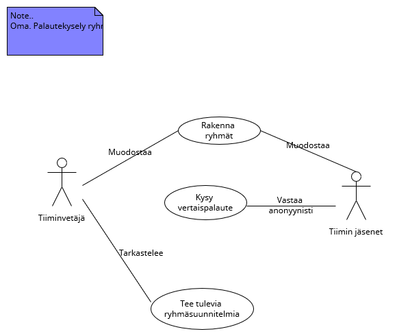
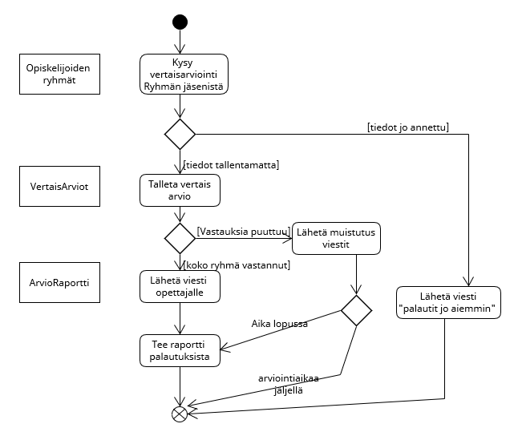

# yleistä selvittelytyötä
Ongelma: voiko MSForms lomakkeita generoida listasta-?
Ei voi: https://techcommunity.microsoft.com/t5/microsoft-forms/can-i-pre-populate-a-microsoft-form-choice-area-with-sharepoint/m-p/2076531

Ilmeisesti on pakko tehdä microsoft apps aplikaatio. 

Microsoft Listaan automaattisesti kasvava ID-kenttä
https://techcommunity.microsoft.com/t5/sharepoint/auto-increment-number-field-in-a-sharepoint-list/m-p/1141477

# Toimintaohjeita ratkaisun kehitykseen
Kun käytetään MS power - perhettä low code kehityksessä kannttaa lähteä liikkeelle Siitä mitä tietoa tarvitaan.

* Katsokaa käyttötapauskaaviotanne ja listatkaa tiedot joita tarvitsette. Ja vain tiedot joita tarvitaan.
* Miettikää käyttötapauskaavioon liittyvät käsitteet, Tehkää niistä listaa. 
* Käyttäkää käsitteitä otsikointa ja listatkaa tiedot/tietoalkiot noiden otsikoiden alle. 
* Jos tieto/tietoalkio liittyy useampaan useampaan käsitteeseen, listatkaa se kaikkien käsitteiden alle
* Tehkää jokaisesta käsitteestä microsoft list -lista, listan nimeksi käsite, sarakkeiksi tiedot/tietoalkiot.

# Esimerkki: 
tiimin tehtävälista- käyttötapauskaavio

Ryhmien muodostus on monimutkainen operaatio joka jakautuu mahdollisesti useampiin mahdollisiin skenaarioihin, joissa on vaihtelevia tietotarpeita, joten liian haastava tähän. 

## **Kysy vertaispalaute**
Opettajan laittaa vertaispalaute-kyselyn auki. Kaikilta ryhmäläisiltä kysytään. Lopuksi tehdään raportti ryhmästä. 
Alla Aktiviteettikaavio. 

## **Kysy vertaispalaute** käyttötapauksen tietovarastot
Opettajan antaa opiskelijoille ryhmätyön vertaispalautelomakkeen kurssin päätteeksi. 
Ryhmän jäsenelle näytetään lomake jossa kysytään aktiivisuus/kontribuutio-arvio kaikista ryhmän jäsenistä asteikolla 1-5, 5 hyvin aktiivinen 1 ei ollenkaan aktiivinen. Myös itsestä pitää antaa "oma-arvio". 
Lisäksi vapaamuotoinen arvio-teksti toiminnasta

* Käsitteet alustavasti:
* Opiskelijoiden ryhmät: nämä ovat lähtötietona (VAGroups)
    * opiskelija (otsikko/Title)
    * ryhmä
* VertaisArviot: Ryhmäläisten antamat (VAPeerReviews)
    * Opiskelija (otsikko/Title)
    * Arvioitava opiskelija
    * Ryhmä
    * Arvio
    * Arvioteksti
* ArvioRaportti: vertaisarvioista jalostettu kun kaikki on annettu (VAReviewReport)
    * Opiskelija (otsikko/Title)
    * Ryhmä
    * laskettu arvio-koonti
    * yhdistetty arvioteksti

# Havaittuja lisätarpeita
Kaikkeen "speksaustyöhön" pitäisi saada palautekanava. Jos tulee jotain mieleen jälkikäteen: lisäyksiä tai muutoksia, pitäisi olla helppo nopea tapa kirjata sellainen ylös käsiteltäväksi myöhemmin. Pitäisi pystyä helposti liittämään muutos aiheeseen. Esim. katselmointikommentti suoraan vaikkapa aktiviteettikaavion johonkin elementtiin tai useampaan elemenettiin. 

